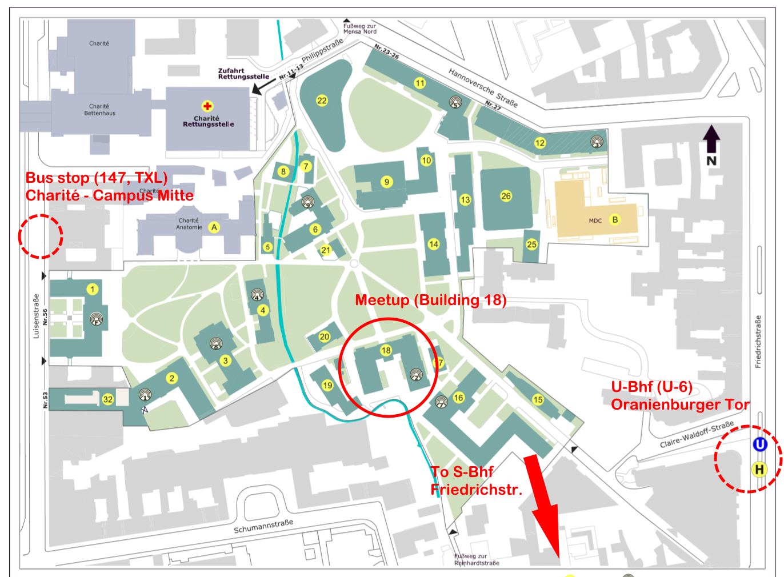

# INVITE TO A MEETUP ON 10.7.19, Wed, 6:30 pm

Hi everyone,

Mu Sigma is a group of motivated people interested in statistics, data science, and philosophy of knowledge. Since few weeks, we've been organizing meetups where we read papers, discuss what's happening in the field, and just hang out together. The discussions in our meetings mainly revolve around following topics:
  * What is knowledge and how should it be obtained
  * Theory and application of statistical methods (including software)
  * How science should be organized and how to fix the replicability crisis, which some fields of study are currently in

We would like to meet new people with similar interests and thus invite you to join us on the next Wednesday, on July 10, starting from 6:30 pm (18:30). The meetup will take place in the room 104, house 18 of the Campus Nord of Humboldt university (Philippstraße 13 10115 Berlin). Feel free to come and check out if you might be interested.

You can find the protocols of our last meetups and a perspective reading list on [github](https://github.com/aaronpeikert/methods-meetup)

The next paper to be discussed is "A free energy principle for biological systems" by Karl Friston1, which is often regarded as a key question for artificial intelligence. Reading a paper is a pre-requisite in order everyone can add something to discussion, although you surely don't have to understand all the technicalities.

Feel free to show up and join our discussion! You should have basic knowledge of statistics, but our members come from different backgrounds, ranging from philosophy and psychology over to computer science and mathematics. It also doesn't matter if you are still a student, already working in business or writing your PhD - we welcome everyone! If you have any questions, just contact us in our [Telegram group](http://t.me/mu_sigma).

Cheers,
Mu Sigma Society
